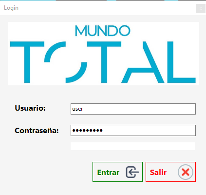
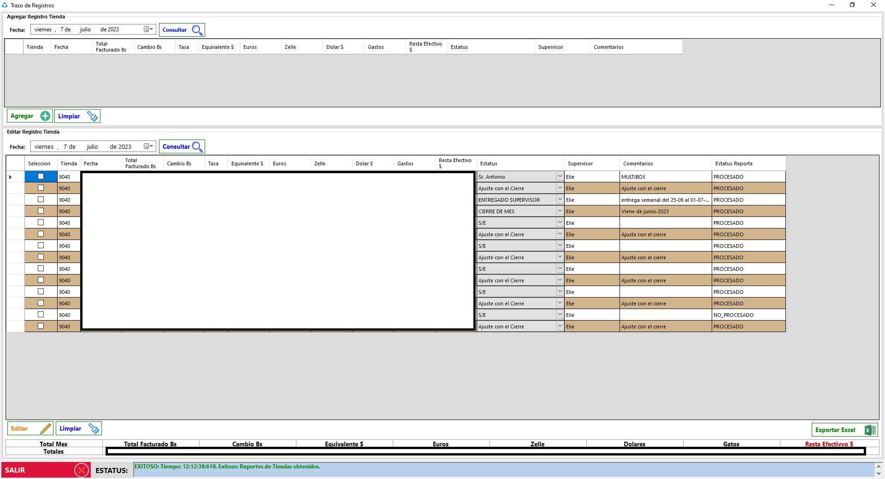

# Trace Register Store

This is an application to record the sales of a store and expenses by day, the applications connects to a REST API to upload and retrieve the records. Using a Token and Https connection.

[WEB SERVICE APPI](https://github.com/aurquiel/WebApplicationTraceRegister)

[ADMIN APP]()

---

## Login

## Main

